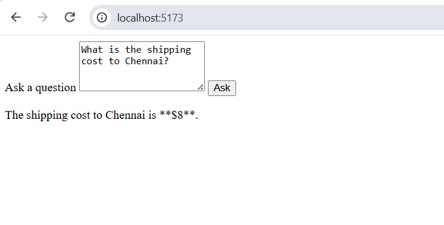

# openrouter-agent-demo
A simple example usage for [openrouter](https://openrouter.ai/) with one agent and one tool

## Usage

1. Install node.js, Typescript, and [Vite](https://vite.dev/)

1. Clone the repo 
   git clone  https://github.com/mapteb/openrouter-agent-demo.git

1. Install the packages 
   npm install   

1. Add an openrouter API key to the project. Add a file .env.local to the root of the project with: 
   VITE_OPENROUTER_API_KEY=<< your openrouter API key >>

1. Run the project 
   npm run dev

   and access http://localhost:5173/

   Here is a screenshot of the prompt usage:

     
